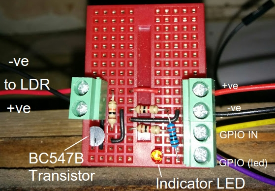
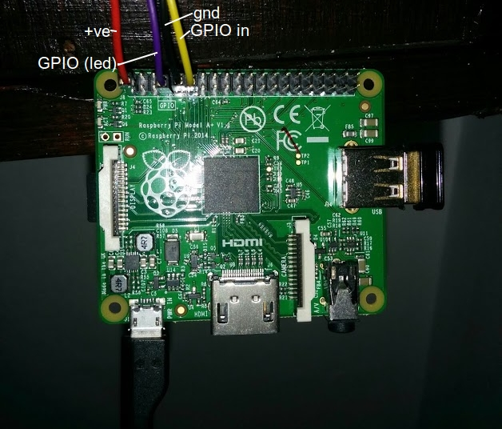

# raspi-elec

This repository contains code for setting up a raspberry pi pulse counter for reading led pulses from an electricity meter.

## Instructions for set up

Currently this has only been tested on ~~[Raspbian Wheezy 2015-05-05](https://www.raspberrypi.org/downloads/raspbian/)~~ [Raspbian Jessie 2015-09-24](https://www.raspberrypi.org/downloads/raspbian/) installed from the img, not using NOOBS.
Note that in future it would be preferable for this to built upon [MINIBIAN](https://minibianpi.wordpress.com/) or similar, to keep setup time to a minimum, as the code requires very little to run.

## Circuit for pulse counting

The pulse counting circuit is built using a light dependent resistor.
When there is a pulse, the resistance in the circuit decreases, and this is recorded.
Initially I was recording this is a very simple circuit using just a capacitor connected to one of the GPIO pins ([see an excellent overview on how to do this here](https://learn.adafruit.com/basic-resistor-sensor-reading-on-raspberry-pi/overview)), but eventually I transitioned to using a more complicated circuit which outputs a single pulse with each flash of the LED, and not a count of time taken to fill a capacitor (as in the simpler circuit).

Here I have drawn heavily on [this rep](https://github.com/kieranc/power), and in turn [this blog](http://blog.christianperone.com/2012/08/raspberry-pi-arduino-a-laser-pointer-communication-and-a-ldr-voltage-sigmoid/).

Breadboard setup:



Rasbpi setup



## Code

At present the script [read_led.py](read_led.py) measures the number of pulses per minute, on a continuous cycle.
A better implementation might be with python interrupts.


## Some testing

I was skeptical that using an LDR (which can be quite slow) would be quick enough to detect flashes over a fraction of a second, so I tested this using the file [test_led.py](test_led.py).
By setting the pi to execute a number of blinks, with random intervals, and counting them back using the pulse counter, I found the LDR to have perfect accuracy over a range of conditions (which sadly I did not record at the time!).

Two test scripts are included, both of which are launched from the command line.

The first [test.py](test.py) can be launched with `sudo python test.py` with an optional argument of the sleep time between measurements (if not specified, this defaults to 0.03 seconds).
The second file [test_led.py](test_led.py) can be used in conjunction with test.py, by directing the LDR at the indicator LED on the breadboard.
test_led.py takes three arguments e.g.: `sudo python test_led.py 10 0.1 10`. These are:

* Number of flashes
* Duration of flash in seconds
* Maximum interval from which a random number will be selected

By adjusting these arguments, you can simulate the kind of flashes that you would receive from your meter, and test whether you are receiving them properly using the [test.py](test.py) script.

## Instructions for setup

* Install raspbian-wheezy 2015-05-05
   * Follow the instructions [here]([Rasbian Wheezy 2015-05-05](https://www.raspberrypi.org/downloads/raspbian/))
* Establish headless wifi connection with pi
   * make sure SSH is enabled
   * because I don't like to connect my pis to monitors (it's a bit of a pain), I pre-install the /etc/wpa_supplicant/wpa_supplicant.cong file on the SD card with the settings from my wifi router. Then i can get online headlessly without trouble. The settings for my wifi network are as follows, yous may be similar:

```
ctrl_interface=DIR=/var/run/wpa_supplicant GROUP=netdev

network={
   ssid="my-base-station-ssid"
   psk="my-password"
   proto=RSN
   key_mgmt=WPA-PSK
   pairwise=CCMP
   auth_alg=OPEN
}

```

* Get the latest updates

```
sudo apt-get update -y
sudo apt-get upgrade -y
```

* Setup logging to Postgres (optional)

```
sudo apt-get install postgresql libpq-dev python-dev python-pip
~~sudo pip install psycopg2~~
sudo apt-get install python-psycopg2
```

* Setup logging to Dropbox (optional)
   * add dropbox access token in access_token.py as: `token=''`
   * `sudo pip install dropbox`
   * add a server_cred.py file with the following lines:

```
db_name = ''
host_ip = ''
username = ''
password = ''
```

* Setup up cron job
   * Add the following lines to crontab with crontab -e.
   * This forces the whole database of readings to be uploaded to Dropbox at 2am every morning, and every time the pi is rebooted.
   * Starts python pulse logging script on reboot.

```
@reboot sudo python ~/elec/read_led.py
@reboot sudo python ~/elec/db.py
* * 2 * * * sudo python ~/elec/db.py
```
